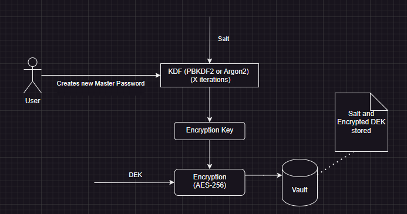

# APass - A Password Manager (2 Week Mini Project)

## Brief Description
This application is a Password Manager written in C# using WPF(Windows Presentation Foundation) and targets the .NET 8.0 framework. It is currently a Work In Progress.

The aim of the application is to provide a simple and secure local application to safely store passwords on a single device.

## Security Model

### Creating the Master Password
This is an entirely offline password manager that requires users to create a Master Password in order to log in.

The Process:

1. Master Password Generation: Users create a strong Master Password. This is the only password they need to remember.
2. Salt Generation: The application generates a unique salt using a cryptographically secure random number generator.
3. Key Derivation: The master password + the salt is put throuigh a Key Derivation Function (KDF). I will most likely use PBKDF2 with 5000-10000 iteratons, but I may choose Argon2 instead which generally requires fewer iterations. I'm not sure yet. The encryption key generated from this step is also known as a Key Encryption Key (KEK)
4. DEK Generation And Encryption: A Data Encryption Key (DEK) is generated independently using a cryptographic random number generator. The DEK is then encrypted with the KEK using a symmetric encryption algorithm. I will either be using AES-256-GCM or AES-256-CBC.
5. The encrypted DEK, along with the salt, will be stored securely in a local database.

### Using the app to store passwords for sites
Once the user is authenticated using their Master Password, they will have access to their password list.

The Process:

1. Decryption of DEK: When a user logs in, the app re-derives the KEK from the entered master password. It also fetches the salt from the db. This KEK is then used to decrypt the stored DEK.
2. Password Encryption: The DEK is used to encrypt individual site passwords. Each password is encrypted using a unique Initialization Vector (IV) to ensure that the encryption is unique even if the passwords are identical.
3. Password Decryption: To view or use stored passwords, the DEK decrypts the selected passwords encrypted data. 
4. Storage: The encrypted passwords should be stored in the local database.

They can also add a new password. These passwords should be encrypted, not hashed, because we need to be able to decrypt these passwords to use them.

Each password here will be encrypted using the DEK. Each passwords encryption will be unique since I will be using unique IVs.

## Notes
This is currently a WIP.