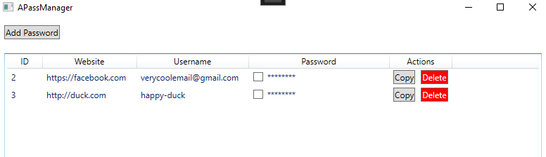
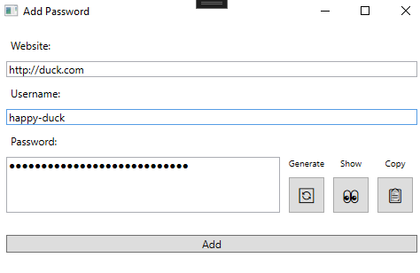

# APass - A Password Manager (2 Week Mini Project)

## Brief Description
This application is a simple Password Manager written in C# using WPF(Windows Presentation Foundation) and targets the .NET 8.0 framework.

The aim of the application is to provide a simple and secure local application to safely store passwords on a single device.

## How To Run
Open the solution file `APass.sln` in Visual Studio. From here simply run the application using visual studio 

_Note: Upon running the application for the first time a SQLite database will be generated in `%LOCALAPPDATA%` on Windows. The path will be different on other OS, but it stores the database in a location that is  conventional of the operating system's norms for user data_

## Screenshots Of The Application

#### First page - Login
When you first start up the application, you should see a login page: 

#### Second page - Sign up
Since you don't have a master password yet, you will have to create one on the sign up page: 

 _Note: here is a random password that fulfills the requirements. You can copy-paste it into the application for testing purposes: `@zoaZZ*dT1(bCUqCP*yl9^(2MZp2VN`_ 

#### Third page - Logged In
After signing up, you can log in with your master page, and you will then see the main window. This is where all your passwords will be shown. Note that there will not be any data upon logging in, the image taken here is after adding passwords 

On this page you also have some options. "Copy" will decrypt the password and copy it to your clipboard.
The delete button will prompt a pop-up, where you can delete an entry from the database after clicking "Yes".
The checkbox will show you the decrypted password in plain text as shown here: 

#### Fourth page - Adding new passwords
You can add new passwords by clicking the `Add Password` button in the Main Window. Doing so will prompt you a pop-up where you can input a new password to save in the manager. You can also generate a cryptographically secure password from here. 

# Discussion about security

## What is the application protecting against?

 - **External Attackers (Hackers, Cybercriminals)**
Generally these threat actors aim to steal sensitive data (like passwords/account details). The aim of this application is to reduce that risk. There is a few key-points that help against this:

1. The master password is not stored, not even as a hash. But rather I store an encrypted `Data Encryption Key`. I use AES-256-CBC for encryption.
This ensures that even if an attacker gains access to the database, it remains unintelligible without the proper decryption key. A rainbow table or brute force attack will not be effective.

2. Generate strong, unique passwords for different websites. One of the main aim of the password manager is to greatly reduce the amount you re-use your password on different sites. This password manager can generate strong passwords and keep track of them. This protects against actors who take advantage of data breaches.

3. Since this is completely offline, a Man-in-the-Middle attacks is not a security risk. (Being offline also comes with some limitations, of course. More on this later)

## Security Model

### Creating the Master Password
This is an entirely offline password manager that requires users to create a Master Password in order to log in.

The Process:

1. **Master Password** Generation: Users create a strong Master Password. This is the only password they need to remember.
2. **Salt Generation:** The application generates a unique salt using a cryptographically secure random number generator.
3. **Key Derivation:** Based on the master password + the salt, a hash is calculated. This is done by using `PBKDF2` with 10 000 iterations. The encryption key generated from this step is also known as a `Key Encryption Key (KEK)`
4. **DEK Generation And Encryption:** A `Data Encryption Key (DEK)` is generated independently using a cryptographic random number generator. The DEK is then encrypted with the KEK using AES-256-CBC.
5. The encrypted DEK, along with the salt, will be stored securely in a local database.

The process can be illustrated as following:

### Using the app to store passwords for sites
Once the user is authenticated using their Master Password, they will have access to their password list.

The Process:

1. **Decryption of DEK:** When a user logs in, the app re-derives the KEK from the entered master password. It also fetches the salt from the db. This KEK is then used to decrypt the stored DEK.
2. **Password Encryption:** The DEK is used to encrypt individual site passwords. Each password is encrypted using a unique Initialization Vector (IV) to ensure that the encryption is unique even if the passwords are identical.
3. **Password Decryption:** To view or use stored passwords, the DEK decrypts the selected passwords encrypted data. 
4. **Storage:** The encrypted passwords should be stored in the local database.

## Cryptographic choices

### PBKDF2 for Key Derivation
PBKDF2 (Password-Based Key Derivation Function 2) with HMAC-SHA-512 as the underlying hash function is what i chose for KDF. I choose to use 10 000 iterations, which seems to strike a decent balance between resistance to brute-force attacks and performance. 

I had a thought about using Argon2id for KDF instead. After all, why wouldn't you use a state-of-the-art hashing technology? The main reason I ultimately chose against it, is because there is no native .NET library implementation of it. You would have to use a third-party library like [Koncsious.Security.Cryptography](https://github.com/kmaragon/Konscious.Security.Cryptography) which haven't been updated in 2 years. This is not necessarily a problem, and from my understanding it still works completely fine with .NET 8.0. However, if I can avoid using third-party libraries that seemingly aren't getting updated I would prefer that.

Besides, PBKDF2 with HMAC-SHA-512 is still (currently) considered secure and the implementation is very simple.

### Aes-256-CBC for Encryption/Decryption
AES (Advanced Encryption Standard) with 256-bit key size in CBC (Cipher Block Chaining) mode is what I use for encrypting the DEK and user passwords.

I chose this because AES-256 is widely used and recognized for its strength and resistance against brute-force attacks. AES has been highly tested and has proven its resistance.

CBC mode is the slightly simpler version of the bit more advanced version "Galios/Counter Mode" (GCM). GCM Could provide some further benefits, especially because it provides an authentication tag that can be used to verify the authenticity of the entire message that was encrypted. Furthermore the Counter Mode(CTR) allows for parallel processing, which could improve the performance for both encryption and decryption tasks.

However, AES-256 with CBC mode is still a secure encryption method, it is the older version so it may provide some more compatibility than the newer GCM. In general however, I do think for the majority of cases (as well as for APass) GCM is the better choice.

## Pitfalls / Limitation of the solution
For this simple password managers, there is some limitations and pitfalls that are outside the scope of the assignment. 

### 1. Storing the DEK In-Memory
Security is often a trade-off. This application is no different.

Once a user logs in with their master password, the encrypted DEK gets decrypted and stored in memory. This is necessary, because we need the DEK to decrypt the passwords stored inside the password manager. If we decided not to store it in memory, the user would have to re-enter their master password every time they needed to encrypt or decrypt passwords within the application. This may however allow sophistacated memory attacks to retrieve the DEK.

To mitigate the risks this may cause, the DEK is only stored in memory for a limited time of 10 minutes. Afterwards the user will be prompted to re-enter their master password. This fixed session timeout of 10 minutes may not be optimal for all use cases. Something like dynamic session management based on user activity or risk analysis could provide better security usability trade-offs. That is outside the scope of this assignment though.

### 2. Lack of 2FA
This application does not have a Two-Factor Authentication(2FA) system. Adding 2FA would significantly enhance the security by adding an addfitional verification step beyond the master password. [KeePass](https://keepass.info/help/base/keys.html) has a system, where you generate a `key file`. This key file contains a key (and possibly additional data) that may not be modified. You keep this file locally, and when you want to login to your manager, you need your master password (knowlegde) + the file that you saved somewhere safe (poessision). This is a smart way of providing 2FA to a offline system.

### 3. No look-up table for signing up with a new Master Password
There are certain requirements that must be met for creating a master password. It must have a "score" of at least 65, include a special character, number and a capital letter. The scoring system is based on different factors such as length, special characters, numbers, etc. 

There is room for improvement though, as the solution does not checked for passwords that have been leaked previously. An example: "P@sSw0rD!" may look like a decent password to the application, but should still be considered weak as it is a common password that have been leaked. An idea is to use the [Have I Been Pwned API](https://haveibeenpwned.com/API/v3) to improve the requirements of the password.

### 4. The Human Factor - Forgetting the master password
Forgot your master password? Too bad!

That is unfortauntely the reality for this application. If you forget your master password, there is no way to recover it. Many websites simply have a `Forgot Your Password?` type of button. For password managers, the process behind the scenes has to work a bit differently since the encryption is based on the master password. [LastPass](https://blog.lastpass.com/posts/2022/03/forgot-your-password-your-guide-to-lastpass-account-recovery) solves this in a smart way, where they use secure, local data to "prove" the users identity and facilitate the re encryption of their vault with a new master password. 
